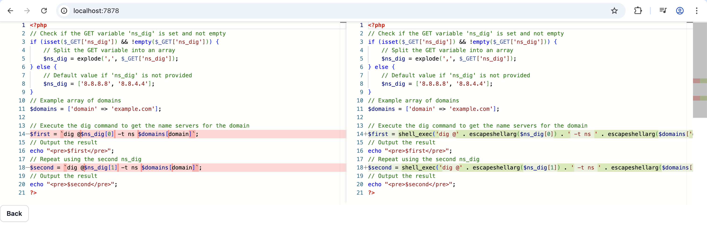

# PHP Backtick Remover



This repository contains a web application that helps remove backticks from PHP code to prevent remote code execution (
RCE) vulnerabilities. The application consists of two main components:

1. **API**: A backend service built with Hono.js that leverages OpenAI's GPT-4o model to analyze and fix PHP code.
2. **Web**: A React frontend that provides a user interface for submitting PHP code and viewing the fixed result.

## Prerequisites

- [Docker](https://docs.docker.com/get-docker/) and [Docker Compose](https://docs.docker.com/compose/install/)
- [Node.js 22](https://nodejs.org/) for local development
- OpenAI API key

## Environment Setup

### Environment

Update the `.env` file in the `api` directory with an OpenAI API key.

```
OPENAI_API_KEY=
```

## Docker

To test the assignment, simply run it with Docker.

```bash
docker compose up -d
```

The website will be available at http://localhost:7878.

## Development Setup

### API Setup

Navigate to the API directory:

```bash
cd api
```

Install dependencies:

```bash
npm install
```

Start the development server:

```bash
npm run dev
```

The API will be available at http://localhost:7879

### Web Setup

Navigate to the web directory:

```bash
cd web
```

Install dependencies:

```bash
npm install
```

Start the development server:

```bash
npm run dev
```

The web application will be available at http://localhost:7878

## Further Improvements

* Tests
* Improved error handling and validation
* Tweak and evaluate LLM instructions and different models
* Linting and code-style formatting